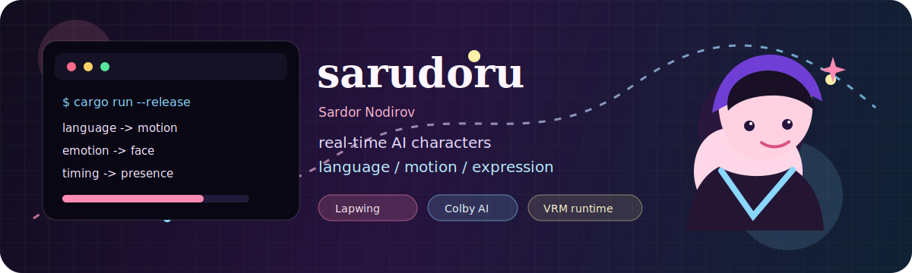
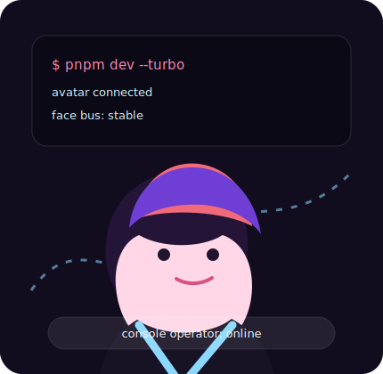
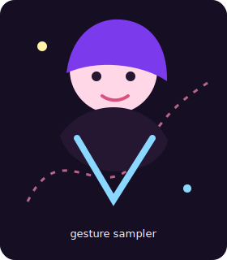
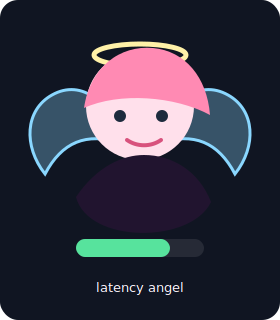
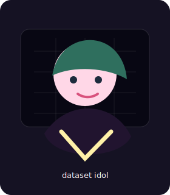
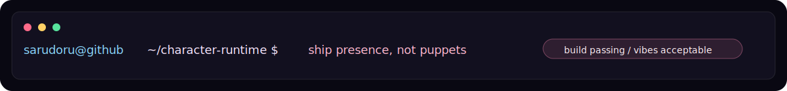

<p align="center">
  
</p>

<p align="center">
  <a href="https://nodirov.com"></a>
  <a href="https://lapwing.live"></a>
  <a href="https://github.com/sarudoru"></a>
  
</p>

<p align="center">
  
</p>

## Visitor Count


<br>

<table>
  <tr>
    <td width="62%" valign="top">

      <h3><code>whoami</code></h3>
      <p>I build real-time AI systems for characters that can think, speak, move, and emote without feeling like a frozen chatbot taped to a 3D model.</p>
      <p>Right now I am shipping character infrastructure at <b>Lapwing</b>, finishing a <b>CS + AI honors thesis at Colby</b>, and staying mildly unreasonable about motion, expression, latency, and browser-side performance.</p>
      <p>My favorite stack is the one where language turns into visible behavior: dialogue, gesture, facial animation, lip-sync, personality, timing, all the little things that make a virtual character feel present instead of rendered.</p>

    </td>
    <td width="38%" valign="top">
      
    </td>
  </tr>
</table>

<p align="center">
  
</p>

<table>
  <tr>
    <td align="center" width="25%"></td>
    <td align="center" width="25%"></td>
    <td align="center" width="25%"></td>
    <td align="center" width="25%"></td>
  </tr>
  <tr>
    <td align="center"><sub><b>motion generation</b></sub></td>
    <td align="center"><sub><b>browser graphics</b></sub></td>
    <td align="center"><sub><b>low-latency systems</b></sub></td>
    <td align="center"><sub><b>multimodal data</b></sub></td>
  </tr>
</table>

## current loop

```txt
prompt -> intent -> behavior plan -> speech -> motion -> face -> VRM runtime
          |                                                     ^
          +---------------- timing / emotion / memory ----------+
```

- building **Lapwing**, a real-time interactive character platform
- researching **conversational motion generation** for virtual characters
- wiring language models into animation systems that actually show their work on the body
- keeping the browser fast enough that the illusion survives contact with reality

## working taste

<p>
  
</p>

<table>
  <tr>
    <td><b>frontend</b></td>
    <td>React, Next.js, Three.js, VRM runtimes, WebSockets, weird browser timing problems</td>
  </tr>
  <tr>
    <td><b>backend</b></td>
    <td>FastAPI, async orchestration, Redis queues, low-latency speech and motion pipelines</td>
  </tr>
  <tr>
    <td><b>research</b></td>
    <td>motion generation, gesture retrieval, multimodal LLMs, embodied conversational agents</td>
  </tr>
  <tr>
    <td><b>taste</b></td>
    <td>systems that feel alive, interfaces that stay quiet, anime girls with real infrastructure behind them</td>
  </tr>
</table>

<p align="center">
  
</p>

## stats, because GitHub lets us put little machines in markdown

<p align="center">
  
  
</p>

<p align="center">
  
</p>

<p align="center">
  
</p>

<p align="center">
  
</p>

## small map

<table>
  <tr>
    <td width="50%" valign="top">

      <pre><code>/characters
  /motion
  /speech
  /face
  /memory
  /timing</code></pre>

    </td>
    <td width="50%" valign="top">

      <pre><code>/systems
  /async
  /render
  /deploy
  /observe
  /ship</code></pre>

    </td>
  </tr>
</table>

<p align="center">
  
</p>

<p align="center">
  <sub>
    If something here is blinking, moving, counting, or graphing itself, good. Static profiles are a little suspicious.
  </sub>
</p>
